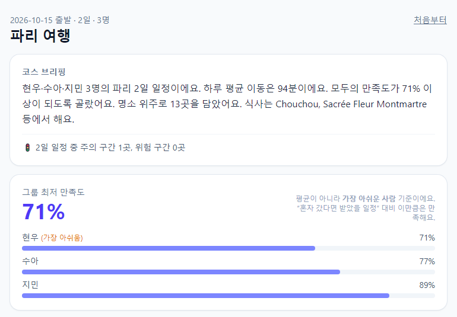
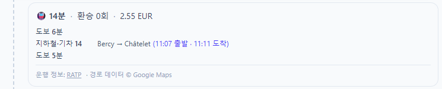
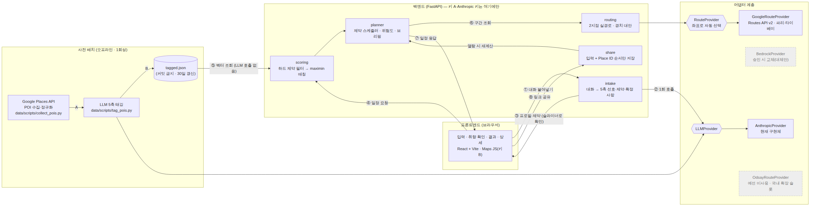

# 모두의 여행 — AI 그룹 여행 플래너

단톡방 대화를 붙여넣으면, **아무도 소외되지 않는** 여행 일정을 **실제 대중교통 시간표**에 맞춰 만들어 준다.

> 고려대학교 x AWS AI Innovators Challenge (AI Tech Day 2026) 출품작 — KUAWS 팀
> 예선 8/18 ~ 9/29 · 본선 10/3 ~ 10/18 · 최종 발표 10/19

<p align="center">
  <br>
  
</p>
<p align="center"><sub>정반대 취향 3인의 파리 2일 일정(실제 Claude·Google Routes 호출, 9/27). 위: 평균이 아니라 가장 아쉬운 사람의 만족도를 먼저 보여준다. 아래: 11:07 출발·11:11 도착 — 지어낸 시간이 아니라 실제 편성이다.</sub></p>

---

## 문제

그룹 여행 일정 조율은 여전히 카톡과 스프레드시트의 몫이다. 기존 플래너는 1인 취향을 전제하고,
여러 명의 취향을 단순 평균하면 **아무도 만족하지 않는 밋밋한 일정**이 나온다.
LLM 에게 맡기면 그럴듯하지만 **존재하지 않는 버스 노선과 시간표**를 지어낸다.

## 해결

| | 무엇을 | 어떻게 |
|---|--------|--------|
| 1 | **대화 → 취향** | 단톡방 대화를 화자별로 나눠 LLM 이 5축 취향(활동량·혼잡 허용·자연↔도심·식사 비중·속도)과 알레르기 같은 절대 조건을 뽑는다. 확신이 낮은 축만 슬라이더로 되묻는다. |
| 2 | **아무도 소외되지 않게** | 평균이 아니라 **가장 손해 보는 사람의 만족도**를 최대화(정규화 maximin)해 장소를 고른다. |
| 3 | **진짜 이동 경로** | Google Routes API v2 의 **실제 편성 출발·도착 시각**으로 일정을 배치한다. 식사 시간(점심 11:30~13:30·저녁 18:00~20:00), 하루 이동 상한, 막차까지 지킨다. |
| 4 | **실패 위험 미리 보기** | 환승 연결 여유(실제 시간표), 영업 종료 여유, 식사 피크 도착 같은 **객관 지표만으로** 장소별 실패 확률을 보여준다. 유명하다고 감점하지 않는다. |
| 5 | **경치 좋은 길** | 같은 호출로 받은 대안 경로 중 공원·명소를 지나는 길을 “+6분, 경치”로 함께 보여준다. |
| 6 | **링크 하나로 공유** | 특정 메신저에 종속되지 않는 링크. 경로는 저장하지 않고 열 때 최신 시간표로 다시 계산한다(약관 준수). |

## 핵심 설계 3가지 (코드 위치)

| 설계 | 무엇이 다른가 | 코드 |
|------|---------------|------|
| **RoutingProvider 어댑터** | 스케줄러는 어떤 라우팅 API 인지 모른다. 좌표로 제공자를 고르고(해외 = Google Routes v2, 국내 = ODsay 참조 구현), 공통 모델의 `depart_at`/`arrive_at`(실제 편성 시각) 덕분에 제공자가 바뀌어도 스케줄러·위험도가 그대로 돈다 | [`backend/routing/provider.py`](backend/routing/provider.py) · [`google_provider.py`](backend/routing/google_provider.py) · [`planner.py`](backend/routing/planner.py) |
| **사전 배치 vs 런타임 분리** | POI 성향 벡터는 오프라인에서 한 번 계산해 두고 런타임에는 조회만 한다. 일정 생성 요청의 런타임 LLM 호출은 **0회**, 대화 해석만 1회 | [`data/scripts/tag_pois.py`](data/scripts/tag_pois.py) · [`backend/planner/service.py`](backend/planner/service.py) |
| **maximin 그룹 매칭** | 평균이 아니라 **가장 불만족한 멤버의 적합도**가 그룹 점수다. 평균으로 바꾸면 한 사람이 크게 손해 보는 장소가 다른 사람 점수에 가려 위로 올라온다 — 실데이터 비교에서 상위 10곳이 **하나도 겹치지 않았다**([PoC](docs/POC.md)) | [`backend/scoring/matcher.py`](backend/scoring/matcher.py) |

## 지원 도시 — 데이터 품질을 직접 검증한 도시만

현재 지원: **파리(데모 도시) · 타이베이(아시아 사례)**. 대중교통 데이터 품질은 도시마다 크게 다르다.
9/6 스모크 테스트에서 7개 도시를 단계별로 진단했고, Google Routes API v2 가 TRANSIT 경로와
**실제 편성 시각**을 실제로 반환하는 것을 호출로 확인한 도시만 넣었다.

| 도시 | DRIVE | TRANSIT | 판정 |
|------|:-----:|:-------:|------|
| 파리 | ⬤ | ⬤ | **지원** — 편성 시각·운영기관·요금 7/7, 응답 0.6초 |
| 타이베이 | ⬤ | ⬤ | **지원** — 7/7, 응답 0.5초 |
| 런던 · 싱가포르 · 방콕 | ⬤ | ⬤ | 예비 — POI 수집만 하면 추가 가능 |
| 도쿄 · 오사카 | ⬤ | ✗ (0개) | 제외 — Google 이 일본 대중교통 경로를 API 로 제공하지 않음 |

도쿄는 DRIVE 는 정상(좌표·키 문제 아님)인데 TRANSIT 만 200 + 빈 응답이었다. 문서로는 사전 확인이
불가능하고 호출로만 판정된다. → [docs/DECISIONS.md](docs/DECISIONS.md) 2026-09-06

---

## 아키텍처



- **사전 배치 vs 런타임 분리** — POI 태깅은 오프라인 1회. 일정 생성 요청의 런타임 LLM 호출은 0회다.
- **RouteProvider 어댑터** — 좌표로 제공자 자동 선택(해외 Google Routes v2 / 국내 ODsay). 도시 확장 = 어댑터 추가.
- **LLMProvider 어댑터** — 현재 Anthropic API 직접 호출, Bedrock 은 구현체 교체만으로 전환 가능.
- **키 격리** — Routes·Places 키는 백엔드에만(IP 제한), 브라우저에는 Maps JS 전용 키(리퍼러 제한).

자세한 설명·수식: [docs/ARCHITECTURE.md](docs/ARCHITECTURE.md)

---

## 빠른 시작 (Windows PowerShell 기준)

### 1. 백엔드 — `C:\project\KUAWS` 에서

```powershell
python -m venv .venv; .\.venv\Scripts\Activate.ps1
pip install -r requirements.txt
Copy-Item .env.example .env     # 이후 Kiro 에디터로 .env 에 키를 채운다(PowerShell Set-Content 금지 — BOM)
uvicorn backend.main:app --reload --port 8000
```

확인: http://localhost:8000/health → `{"status":"ok"}`, API 문서: http://localhost:8000/docs

### 2. 프론트엔드 — `C:\project\KUAWS\frontend` 에서

```powershell
npm install
npm run dev                      # http://localhost:5173
```

### 3. 장소 데이터 (처음 한 번, 약 10분)

```powershell
python data/scripts/collect_pois.py --city paris  --limit 150   # Google Places 수집
python data/scripts/collect_pois.py --city taipei --limit 150
python data/scripts/tag_pois.py --city paris                    # LLM 5축 태깅
python data/scripts/tag_pois.py --city taipei
```

데이터가 없으면 리포에 들어 있는 예시 장소(`mocks/poi_seed/`)로 동작하고 화면에 안내가 뜬다.

### 키 없이 화면만 돌려보기

`.env` 에 `ROUTING_MOCK=1`, `LLM_OFFLINE=1` 을 넣으면 Google·Claude 호출 없이 끝까지 동작한다
(모의 경로는 운영기관 칸에 “모의 경로(실제 운행 정보 아님)”이 표시된다. **데모에서는 끌 것**).

### 환경변수

| 이름 | 위치 | 설명 |
|------|------|------|
| `ANTHROPIC_API_KEY` | `.env` | 대화 → 취향 추출, POI 태깅 |
| `ANTHROPIC_MODEL` | `.env` | 선택. 기본 `claude-sonnet-5` (`backend/common/config.py`) |
| `GOOGLE_BACKEND_API_KEY` | `.env` | 키 A — Routes + Places, IP 제한 |
| `VITE_GOOGLE_MAPS_JS_API_KEY` | `frontend/.env.local` | 키 B — Maps JavaScript 전용, 리퍼러 제한 |
| `PUBLIC_BASE_URL` | `.env` | 공유 링크 앞부분. 기본 `http://localhost:5173` |
| `ROUTING_MOCK` / `LLM_OFFLINE` | `.env` | `1` 이면 모의 경로 / 규칙 기반 추출 (개발·CI 전용) |

---

## API

응답은 camelCase(`shared/types/api.ts`), 요청은 camelCase·snake_case 모두 받는다.
단일 기준은 [`shared/types/models.py`](shared/types/models.py) 이며 `/docs`(Swagger)에서 바로 호출해 볼 수 있다.

| 메서드 | 경로 | 요청 → 응답 | 설명 |
|--------|------|-------------|------|
| GET | `/health` | → `{status}` | 헬스 체크 |
| POST | `/api/intake/chat?city=paris` | `ChatIntakeRequest` → `ChatIntakeResponse` | 단톡방 대화 → 화자별 프로필 + 그룹 하드 제약 + 꼭 갈 곳 |
| POST | `/api/intake/message?city=paris` | `IntakeMessageRequest` → `IntakeMessageResponse` | 1명의 자유 텍스트(이어서 보내면 대화 맥락 유지) |
| POST | `/api/intake/answer` | `IntakeAnswerRequest` → `IntakeMessageResponse` | 후속 질문(슬라이더) 응답 반영 |
| GET | `/api/intake/profile/{memberId}` | → `PreferenceProfile` | 현재 프로필 |
| GET | `/api/planner/cities` | → `CityInfo[]` | 지원 도시와 데이터 출처(collected / seed) |
| POST | `/api/planner/plan` | `PlanRequest` → `Itinerary` | 일정 생성 (422 입력 오류 / 503 경로 API 오류) |
| POST | `/api/share` | `ShareRequest` → `ShareLinkResponse` | 공유 링크 생성(30일) |
| GET | `/api/share/{planId}` | → `Itinerary` | 공유 링크 열람(경로 재계산) |

요청 예시 — `POST /api/planner/plan`

```json
{
  "city": "paris",
  "days": 2,
  "startDate": "2026-10-15",
  "members": [
    {
      "memberId": "m1", "memberName": "민지", "rawText": "", "updatedAt": "",
      "axes": [
        {"axis": "activity_level", "value": 0.3, "confidence": 0.8},
        {"axis": "crowd_tolerance", "value": 0.4, "confidence": 0.6},
        {"axis": "nature_vs_urban", "value": 0.9, "confidence": 0.8},
        {"axis": "food_priority", "value": 0.5, "confidence": 0.5},
        {"axis": "pace", "value": 0.3, "confidence": 0.8}
      ]
    }
  ],
  "constraints": {"excludeCategories": [], "avoidKeywords": ["seafood", "fruits de mer"], "notes": []},
  "mustVisit": ["Musée du Louvre"]
}
```

응답 `Itinerary` 의 주요 필드: `days[].stops[]`(도착·출발 시각, 멤버별 적합도, 실패 확률과 근거),
`days[].segments[]`(실제 편성 시각이 붙은 leg, 환승 수, 요금, 운영기관, 경고 배지, 경치 대안),
`minMemberSatisfaction` / `memberSatisfaction`, `briefing`, `warnings`, `excludedNotes`, `stats`.

---

## 구조

```
.kiro/            Kiro 에이전트 설정 — steering(팀 규칙) · specs(기능별 요구사항) · hooks
backend/
  intake/         대화 → 5축 선호 벡터·하드 제약 (LLM + 규칙 폴백)
  scoring/        하드 제약 필터 · 정규화 maximin 매칭 · 후보 선별
  planner/        제약 스케줄러 · 실패 위험도 · 브리핑 · 일정 조립 · API
  routing/        RouteProvider 어댑터(Google v2 / ODsay / 모의) · 2지점 실경로 · 경치 경로
  share/          공유 링크(SQLite, Place ID 순서만)
  common/         설정 · LLM 계층 · 프롬프트(prompts/*.md) · 도시 · POI 로더 · 로깅
frontend/         React 18 + TypeScript + Vite + Tailwind
shared/types/     API 계약 (models.py ↔ api.ts, PM 소유)
data/scripts/     POI 수집 · 태깅 · 검수 스크립트 (산출물은 커밋하지 않음)
mocks/            가짜 카톡 대화 5종(chats/) · 예시 POI(poi_seed/)
scripts/          외부 API 프로브 · 수직 관통 스파이크
docs/             아키텍처 · 의사결정(ADR) · PoC · 데모 · 테스트 기록
tests/            pytest (외부 API 는 전부 목/모의)
```

## 테스트

```powershell
pytest -q                        # 백엔드 — 외부 API 호출 없음
ruff check backend shared data/scripts
cd frontend; npm test; npm run build
```

CI(GitHub Actions)가 PR 마다 위 명령과 `.env` 커밋 여부를 검사한다.

## 본선(10/3~) 계획 — 예선 범위 밖

- 일본 도시: 일본 전용 라우팅 어댑터(`RouteProvider` 구현체 추가)
- LLM 코스 브리핑 복원(현재 규칙 기반 템플릿, `LLMProvider` 뒤에 붙이면 됨), 택시 대안 재투입
- AWS EC2 배포, UI 고도화

## 알려진 한계 (예선)

- 알레르기 필터는 **음식점 이름** 기준이다. 메뉴 단위로는 거르지 못한다.
- 지원 도시는 2곳. 좌표는 Google 약관상 30일마다 재수집해야 한다.
- 경치 점수는 경로 주변 POI 태그 기반의 근사다(실제 풍경 이미지를 보지 않는다).
- 일정은 최적해가 아니라 "항상 그럴듯한" 탐욕 해다(의도된 선택 — ARCHITECTURE 5.4).
- 체력이 약한 멤버가 있어 하루 이동 상한이 120분으로 낮아지면, 실제 대중교통 시간이 길 때
  끼니 하나가 빠질 수 있다(실측 15회 중 01번 대화). 빠진 끼니는 경고로 알리고 "근처에서 자유롭게"를 권한다.
- 꼭 가고 싶은 곳이 지역 이름(예: 몽마르트르)이면 장소 목록에서 찾지 못하고, 그 사실을 화면에 알린다.

## 기술 스택

Python 3.10+ · FastAPI · Pydantic v2 · Anthropic Claude API(`claude-sonnet-5`) ·
Google Routes API v2 · Google Places API (New) · Google Maps JavaScript API ·
React 18 · TypeScript · Vite · Tailwind CSS · pytest · vitest · ruff

## 팀 (5인)

| 이름 | 역할 | 담당 영역 |
|------|------|-----------|
| 이기준 | 팀장 · 백엔드 | 인프라, 라우팅, 스케줄러 골격, 통합 |
| 홍성민 | 백엔드 · AI 리드 | intake, 스케줄러 제약, 위험도, API 계약 |
| 이재용 | 데이터 | POI 수집·태깅, 매칭, 브리핑·공유 |
| 후보향 | 프론트엔드 | 화면 설계·구현, 약관 표기 |
| 허용준 | PM · 문서 | 기능 명세, 테스트, 문서·발표 |

## 기여 방법

[CONTRIBUTING.md](./CONTRIBUTING.md) 를 먼저 읽는다. 파일 소유권·브랜치 규칙이 머지 충돌을 막는 핵심이다.
