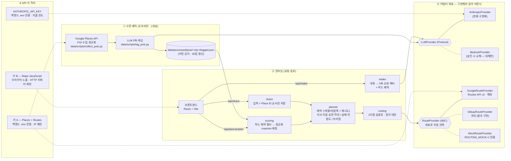
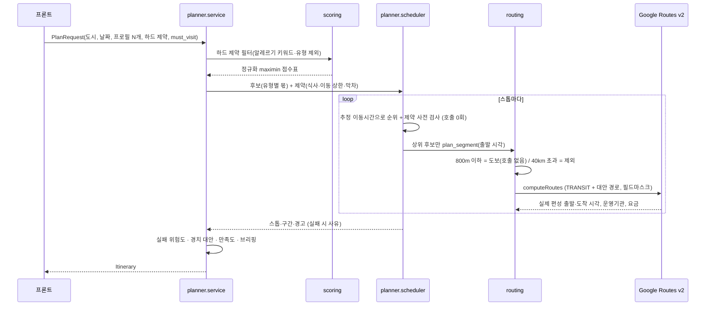

# 아키텍처

> 확정본 (2026-09-27, 예선 제출 기준). 최종 발표(10/19)의 "기술 설명의 명확성" 근거 문서다.
> 다이어그램은 GitHub 에서 Mermaid 로 바로 렌더링된다.

## 1. 한눈에 보기



## 2. 설계 포인트 4가지

### ① 사전 배치 태깅 vs 런타임 호출 분리 — 런타임 LLM 호출 최소화

| 단계 | LLM 호출 | 이유 |
|------|---------|------|
| POI 5축 태깅 | **사전 배치 1회** (도시당 135건) | 모든 요청에서 같은 값 → 미리 계산해 파일로 둔다 |
| 대화 → 선호 벡터 | 런타임 **대화 1건당 1회** (캐시) | 사용자 입력은 미리 알 수 없다. 단톡방 전체를 1회 호출로 화자별 추출 |
| 일정 생성 | **0회** | 매칭·스케줄링·위험도·브리핑 전부 결정적 알고리즘 |
| 코스 브리핑 | **0회** (절단 1) | 규칙 기반 템플릿. 데모 중 API 장애·지연 리스크 제거 |

일정 생성 요청이 외부로 부르는 것은 Google Routes 하나뿐이다. LLM 이 죽어도
`backend/intake/rules.py` 키워드 폴백이 돌아 서비스는 멈추지 않는다.

### ② RouteProvider 어댑터 — 도시별 제공자 선택이 확장성의 근거

- 스케줄러는 `plan_segment()` 만 부르고, 어느 API 인지 모른다.
- `select_provider()` 가 좌표로 자동 선택: 양 끝이 한국이면 ODsay, 아니면 Google Routes v2.
- 새 도시·국가 = 어댑터 1개 추가. 일본(Google TRANSIT 미제공)은 NAVITIME 등 어댑터로 본선 확장.
- 캐싱 정책도 제공자별로 강제(`RouteProvider.cacheable`): Google = 저장 금지, ODsay = 로컬 캐시.

### ③ LLMProvider 어댑터 — Bedrock 은 교체 가능한 대체안

- `shared/types/models.py` 의 `LLMProvider` 프로토콜 뒤로 모델 호출을 격리했다.
- 현재 구현체는 Anthropic API 직접 호출(`backend/common/llm.py`, 2026-08-28 결정).
  Bedrock 신규 계정 진입장벽(모델 승인 대기·on-demand 미지원·낮은 기본 쿼터) 때문이다.
- Bedrock 승인 시 `BedrockProvider` 하나만 추가하고 `get_llm_provider()` 에서 바꾸면 된다.
  태깅·추출 코드는 한 줄도 안 바뀐다.

### ④ API 키 백엔드 격리

- 키 A(Routes·Places)는 백엔드 `.env` 에만 있고 IP 제한이 걸려 있다. 프론트는 `/api` 만 부른다.
- 키 B(Maps JS)는 브라우저에 노출되는 대신 HTTP 리퍼러 제한 + Maps JavaScript API 전용.
  하나로 합치면 노출된 키로 누구나 우리 결제 계정의 Routes 를 무제한 호출할 수 있다.
- CI 가 `.env`/`.env.local` 커밋을 막는다(`.github/workflows/ci.yml`).

## 3. 요청 하나의 흐름 (`POST /api/planner/plan`)



## 4. 왜 LLM 만으로는 안 되는가 (기술적 우월성 근거)

| 단계 | LLM 단독 | 우리 방식 |
|------|----------|-----------|
| 취향 추출 | 가능 | LLM 사용 (적합) — 화자별·신뢰도 포함, 낮으면 슬라이더로 되묻기 |
| 그룹 조율 | 평균적·밋밋한 결과 | **정규화 maximin** — 가장 손해 보는 사람의 만족도를 최대화 |
| 장소 선정 | 근거 없는 추천 | 5축 태깅 벡터 + 하드 제약 필터(알레르기) |
| 대중교통 경로 | **불가능** (환각) | Google Routes v2 실호출 — 실제 편성 시각·운영기관·요금 |
| 실패 위험 | 추측 | 실제 시간표의 환승 연결 여유·영업 종료 여유 등 객관 지표 |

## 5. 알고리즘 정식화

### 5.1 멤버 적합도

멤버 벡터 m, POI 벡터 p (5축, 0~1), 멤버 신뢰도 가중치 w (하한 0.2).

```
cos  = Σ wᵢ(mᵢ−½)(pᵢ−½) / (‖m−½‖_w · ‖p−½‖_w)
dist = Σ wᵢ|mᵢ−pᵢ| / Σ wᵢ
raw(m, p) = 0.6 · (1 + cos)/2 + 0.4 · (1 − dist)
fit(m, p) = raw(m, p) / max_q raw(m, q)          ← 도시 전체에서 그 멤버의 최고값으로 정규화
```

### 5.2 그룹 점수 (정규화 maximin)

```
group(p) = 0.85 · min_m fit(m, p) + 0.15 · mean_m fit(m, p)     (평균은 동점 해소용)
```

### 5.3 그룹 최저 만족도 (결과 화면 지표)

```
sat(m) = mean_{p∈일정} fit(m, p) / mean(그 멤버 혼자라면 고를 상위 |일정|개의 fit)
그룹 최저 만족도 = min_m sat(m)
```

"혼자 여행했다면 받았을 일정 대비 몇 %"로 읽힌다.

### 5.4 스케줄러 (탐욕 + 재시도, 최적해 추구 안 함)

1. 후보를 (그룹 점수 − 0.25 × 추정 이동시간(h) + 식사 가산점) 으로 정렬한다.
2. 추정치로도 제약(휴무·식사 시간대·이동 상한·관광 상한)에 걸리는 후보는 미리 뺀다.
3. 상위 3개만 실제 경로를 조회해 처음으로 제약을 통과하는 곳을 고른다.
4. 하루 최소 3곳을 못 채우면 하위 20% 후보를 빼고 재시도(최대 3회). 그래도 안 되면 **사유와 함께** 반환.

### 5.5 실패 위험도

`1 − (1 − 0.03) · Π(1 − pᵢ)`, 요인은 `backend/planner/risk.py` 표 참고.
인기도·혼잡도는 쓰지 않는다(설계 원칙: 유명하다는 이유로 감점하지 않음).

### 5.6 경치 경로

같은 호출로 받은 대안 경로마다, 경로 좌표 350m 이내 자연·명소 POI 의 `1 − nature_vs_urban` 합.
최단보다 +0.5 이상 높고 추가 소요 20분 이내면 '경치' 대안으로 병기한다(절단 4 수준 = 대안 1개).
그룹 평균 자연 선호가 0.4 이하면 경치 경로를 '우리 그룹 추천'으로 표시한다.

## 6. 데이터와 약관

| 데이터 | 저장 | 근거 |
|--------|------|------|
| Place ID | 영구 가능 | Google 약관 예외 |
| 좌표·영업시간·이름 | `data/processed/` 에만, 30일 후 재수집 | 임시 캐싱 한도 |
| 경로 응답 | **저장 안 함** (메모리에서만) | 약관상 캐싱 금지 → 호출 절감은 Haversine 사전 필터로 |
| 공유 링크 | 입력 + Place ID 순서만 SQLite, 열 때 경로 재계산 | 위 두 규칙의 조합 |
| 리뷰 텍스트 | 수집·저장 안 함 | 태깅 입력은 메타데이터만(2026-09-09) |
| LLM 결과 | `data/processed/cache/llm/` 캐시 | 우리 데이터 — 동일 입력 재호출 방지 |
